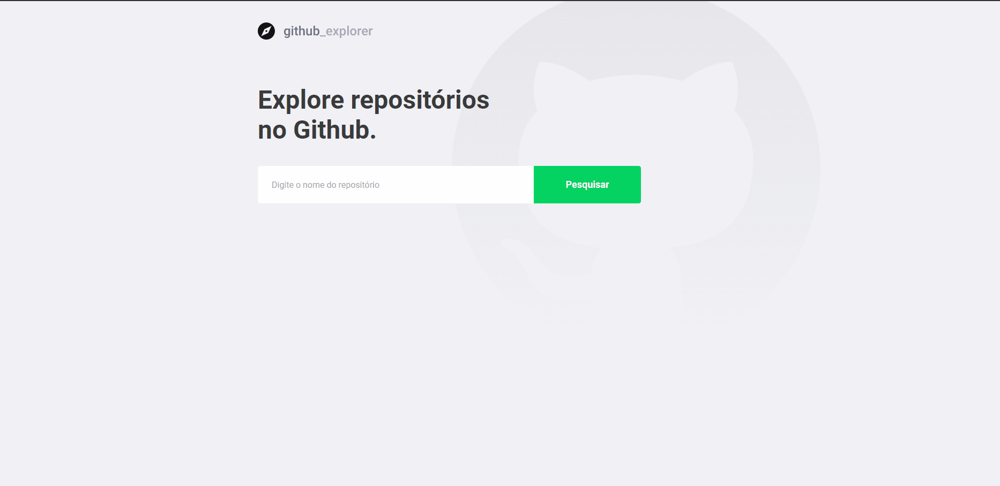

<h1 align="center">
    
</h1>
<p align="center">🚀 Go search for repositories</p>

## See how it works 📸


<h4 align="center"> 
	Project Fizalized 🎉
</h4>

## Features

- Search for a repositories.
- It will save automatically on your localStorage.
- You can also remove it.
- Click on the selected repositories and see their data.

---

## Technologies 👩‍💻

The following tools were used in this project:

- [React](https://pt-br.reactjs.org/)
- [TypeScript](https://www.typescriptlang.org/)
- [Axios](https://github.com/axios/axios)
- [React-icons](https://react-icons.github.io/react-icons/)
- [Styled-Components](https://styled-components.com/)

## Requirements

Before starting 🏁, you need to have [Git](https://git-scm.com) and [Node](https://nodejs.org/en/) installed.

## Starting 🚀

```bash
# Clone this project
$ git clone https://github.com/Artur-Ceschin/github-explorer.git

# Access
$ cd github-explorer

# Install dependencies
$ yarn

# Run the project
$ yarn start

# The server will initialize in the <http://localhost:3000>
```
## License📃

This project is under license from MIT. For more details, see the [LICENSE](./LICENSE.md) file.

### Author
---

Made with ❤️ by Artur Ceschin 👋 Please fell free to contact me!
<br/>
[](https://www.linkedin.com/in/artur-peres-ceschin-programador/) 
[](mailto:artur.ceschin@gmail.com)